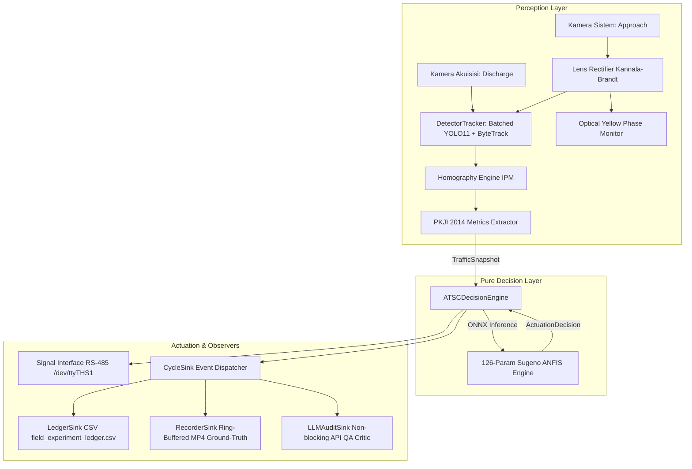

# Adaptive Traffic Signal Controller (ATSC) Production Edge Runtime

Production-grade edge runtime for real-time Adaptive Traffic Signal Control (ATSC) deployed on the **NVIDIA Jetson Orin Nano (8GB, JetPack 6.x)**.

Coordinates computer vision perception (YOLO11 + ByteTrack), metric homography (PKJI 2014), a 126-parameter Sugeno ANFIS control engine, hardware RS-485 cabinet actuation, and non-blocking asynchronous audit sinks.

---

## 1. System Architecture



---

## 2. Directory Layout

```text
.
├── configs/
│   ├── brica_fisheye_calib.npz        # Kannala-Brandt K & D distortion matrices
│   ├── intersection_roi.json          # Homography, lamp ROI, physical area, mode config
│   └── hardware_config.json           # Serial/RS-485 ports, watchdog thresholds, fallbacks
├── models/
│   ├── Final.pt / yolo11s_fp16.engine # Batched YOLO11 vehicle detector
│   └── anfis_sugeno.onnx              # 126-parameter Sugeno ANFIS green-time engine [10s, 120s]
├── src/
│   ├── common/                        # Strongly-typed domain dataclasses (TrafficSnapshot, CycleEvent)
│   ├── perception/                    # Video ingest, lens unwarping, YOLO11+ByteTrack, phase monitor
│   ├── analytics/                     # Homography IPM engine & PKJI 2014 traffic metrics
│   ├── control/                       # ANFIS ONNX inference, pure decision engine, RS-485 interface
│   ├── monitoring/                    # Tegrastats hardware telemetry & dynamic thermal fallback
│   ├── storage/                       # Async MP4 video recorder
│   ├── audit/                         # Async LLM cycle auditor & heuristic fallback
│   └── sinks/                         # Pluggable cycle sinks (CSV ledger, video, LLM)
├── scripts/
│   ├── export_models.py               # TensorRT FP16 engine builder
│   └── replay_debug.py                # Deterministic single-threaded offline replay debugger
├── tests/                             # Comprehensive test suite (19 unit/integration tests)
├── edge_daemon.py                     # Central multi-threaded orchestrator daemon
├── requirements-edge.txt              # JetPack & edge dependencies
└── field_experiment_ledger.csv        # Empirical experiment CSV ledger
```

---

## 3. Installation & Setup

### Requirements
- Ubuntu 22.04 LTS (JetPack 6.x on Jetson Orin Nano, or Linux x86_64)
- Python 3.10+
- PyTorch, ONNXRuntime, OpenCV, Ultralytics, PySerial

```bash
# Clone repository
git clone https://github.com/Marsel204/DeploySkripsi.git
cd DeploySkripsi

# Install dependencies
pip install -r requirements-edge.txt
```

---

## 4. Usage

### 1. Launching Production Edge Daemon (Live Cameras)
```bash
python3 edge_daemon.py \
    --mode DUAL_CAM \
    --source_sys /dev/video0 \
    --source_acq /dev/video1 \
    --headless
```

### 2. Running Field Simulation (Offline MP4 Video with Loop)
```bash
python3 edge_daemon.py \
    --mode DUAL_CAM \
    --source_sys /path/to/approach.mp4 \
    --source_acq /path/to/discharge.mp4 \
    --loop \
    --mock_hardware
```

### 3. Interactive Deterministic Replay Debugger
Inspect perception, IPM tracking, and ANFIS decisions frame-by-frame:
```bash
python3 scripts/replay_debug.py \
    --source /path/to/video.mp4 \
    --step
```
**Controls**:
- `[SPACE]` : Step forward 1 frame
- `[c]` : Run continuously until next Yellow Phase trigger
- `[p]` : Print detailed JSON state dump to console
- `[s]` : Save snapshot image with HUD overlay
- `[q]` : Exit

### 4. Running the Test Suite
```bash
pytest tests/ -v
```
